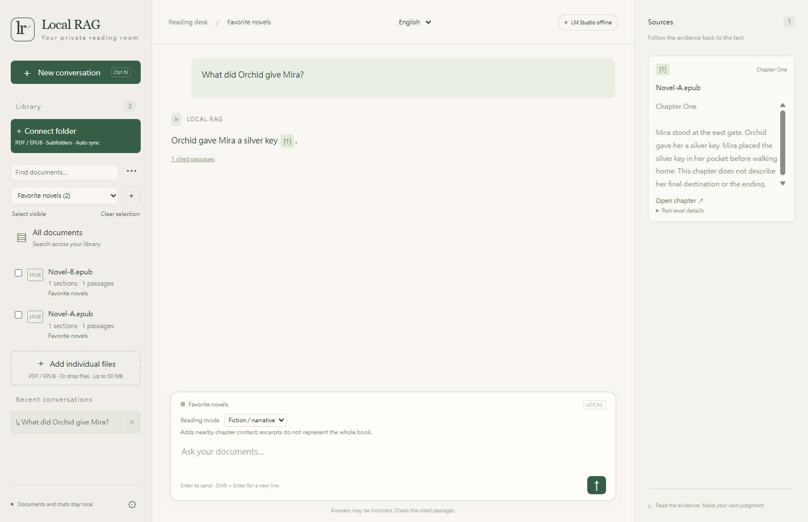

# Local RAG

**A personal reading app for your PDFs and EPUBs.**

Connect a folder, choose what to search, and ask questions with citations back to the original text. Local RAG runs as a Windows desktop app, with answers and embeddings handled by LM Studio on your computer.

The interface supports **繁體中文 · English · 日本語**. The answer model is prompted to respond in the language of your question.



*Example screen with an English answer grounded in a fictional EPUB.*

## Features

- **Folder imports:** watch subfolders for new and changed PDFs and EPUBs, or add individual files with the picker and drag and drop.
- **Focused questions:** search the whole library, a category, one document, or several selected documents.
- **Answers with sources:** stream responses and open cited PDF pages or extracted EPUB chapters.
- **Library organization:** create categories, move documents in bulk, and reopen conversations with their saved search scope.
- **Local model choice:** choose a downloaded answer model or enter its LM Studio identifier manually.
- **Embedding memory control:** release the embedding model after idle periods while keeping the saved index.

## Get started

### 1. Prepare LM Studio

Install LM Studio, download an answer model and an embedding model, then start its Local Server. The app defaults to `http://127.0.0.1:1234`.

| Purpose | Default configuration |
| --- | --- |
| Answers | Qwen3.5-9B, Q4_K_M quantization |
| Answer identifier | `qwen3.5-9b` |
| Embeddings | Qwen3-Embedding-0.6B, Q8_0 quantization |
| Embedding identifier | `text-embedding-qwen3-embedding-0.6b` |
| Answer model context | At least 8,192 tokens |

Check that the identifiers in the app's **Settings** match LM Studio. For scanned PDFs or pages requiring visual transcription, use an image-capable answer model. Qwen also needs its matching vision projection (`mmproj`).

LM Studio runs separately; the app does not install models or start the server. Once dependencies and models are downloaded, document processing and inference can run locally without a cloud API key.

### 2. Launch the app

**From source:** clone or download this repository, install Node.js **22.12 or newer** and `uv`, then open PowerShell in the repository folder:

```powershell
.\setup.ps1
npm start
```

Setup creates a Python 3.11 environment and installs the desktop dependencies. Afterwards, you can also launch with `Start Local RAG.cmd`.

**From a portable build:** open `dist/Local-RAG-win32-x64/Local-RAG.exe`. Keep the entire build folder together. Python and the backend are included; LM Studio and model weights are separate. Build output is generated locally and is not included in the repository.

### 3. Import and ask

1. Click **Connect folder** or **Add individual files**. PDF and EPUB files can be up to 50 MB each.
2. Wait for processing to finish. Exact duplicates are detected even when renamed.
3. Choose a category, click a document, or tick several documents. Check the scope above the question box.
4. Ask a question, then click a citation to inspect its source. **Stop** cancels generation; incomplete answers are not saved.

Switch the interface language at the top of the window. Document text, custom names and saved answers keep their original language.

## Organize your reading

### Categories and selections

Click **＋** beside the category picker to create or rename a category. Tick documents, choose a destination, and click **Move to category**. Each document belongs to one category. Removing a category returns its documents to **Uncategorized** without deleting them or rebuilding indexes.

Category and document selections work together: only selected documents in that category are searched. **Select visible** selects the current list, **Clear selection** selects nothing, and **All documents** returns to the whole library. Empty or missing selections never silently expand to all documents.

Changing scope or reading mode starts a new conversation. Reopening a conversation restores its saved scope. Categories remain live groups whose membership can change as you organize or update files.

### Connected folders

Folders are checked about every 10 seconds while the app is open. Files are imported after their size and modification time stabilize. Reopening the app checks for changes made while it was closed.

| Action | Result |
| --- | --- |
| Add a PDF or EPUB | Queue it for import, including files in subfolders. |
| Update a file | Index a replacement first; a failed update keeps the old searchable version. |
| Move or delete the original | Keep the imported library copy. |
| Disconnect a folder | Keep its imported documents. |
| Delete a document in the app | Remove its copy and index; exclude that unchanged folder version until the source changes or you import it manually. |

Successful replacements inherit the old category unless already classified. Older automatically imported versions are removed only when no other tracked file refers to them; independently imported copies are retained. Original files are never modified.

Use **⋯ → Connected folders** to inspect errors or request a scan. Entire drives, overlapping folders, symlinks/junctions and the app's own data directory are excluded. Changes that preserve both file size and modification time are not detected automatically.

### Fiction mode

Select a book or series, then choose **Fiction / narrative** in the question box. It adds nearby text from the same chapter or PDF page and asks the model to distinguish narration, character statements and inference. Existing indexes work without rebuilding.

This still uses retrieved excerpts. Whole-book summaries, chronology and connections across distant chapters can miss important scenes. Fiction mode does not build chapter summaries or read the entire book for every question.

## Models and memory

**Settings → Answer model** lists downloaded models and their loaded state. The identifier field also accepts custom names. Changing the answer model keeps existing indexes. Changing the embedding model requires an empty library and reimporting documents, because saved vectors depend on that model.

By default, the embedding model stays loaded during imports and is released after 30 seconds idle. The next import or search loads it again. Choose **Keep loaded** to avoid repeated loading delays. Saved vectors remain on disk; this feature leaves the answer model loaded.

Automatic loading and release depend on LM Studio's model-management endpoints. Unsupported servers or closing during an active import can leave the model loaded. Other applications sharing the same embedding instance may need to reload it after release.

## Data and privacy

The default library location is:

```text
%APPDATA%/local-rag-desktop/library
```

It contains the SQLite database, imported file copies and backend logs. **Settings** shows the exact path. Close the app before backing up the entire folder. Deleting a document removes its stored citations; existing answer text remains until its conversation is deleted.

The backend uses a random loopback port with a per-launch session secret. The renderer is sandboxed, and model requests accept only local LM Studio addresses. The application implements no cloud inference or telemetry.

`.gitignore` excludes document files, local databases, indexes, logs, environment files, test artifacts and build output. Ignore rules do not remove files from older Git commits; review files before publishing.

## Current limits

- **Platform:** the portable build targets Windows x64 and is unsigned. Other platforms have not been validated.
- **Extraction:** PDF text extraction and visual transcription can misread equations, tables, scans or unusual fonts. Citations help verify an answer; they do not guarantee accuracy.
- **EPUB:** text follows the book's reading order with chapter references, not fixed page numbers. Original layouts and images are not reproduced. DRM/encrypted chapters and image-only books are unsupported.
- **Retrieval:** exact vector search with keyword rank fusion is intended for personal collections. There is no reranker, and large-library or broad multilingual quality has not been benchmarked.
- **Context:** a conservative budget targets an 8K context, so excerpts and recent history may be shortened. Loading a larger model context does not automatically increase the app's budget.

## Development

```text
Electron renderer → authenticated local FastAPI backend
                         ├─ PDF / EPUB extraction and folder monitoring
                         ├─ SQLite: documents, vectors and conversations
                         └─ LM Studio: embeddings, answers and PDF vision
```

The desktop implementation lives in `desktop/` and `backend/`. Imports run through one background worker; one answer is generated at a time.

### Tests

After setup:

```powershell
uv pip install --python .venv/Scripts/python.exe -r requirements-dev.txt
.venv\Scripts\python.exe -m pytest -q
npm test
```

Python tests cover persistence, imports, category scope, folder updates, embedding lifecycle and prompt limits. `npm test` checks JavaScript syntax.

For integration tests, start LM Studio with the configured models. The category test also needs Playwright's Chromium browser:

```powershell
npx playwright install chromium
node tests/electron-smoke.cjs --live
node tests/electron-folders.cjs --live
node tests/electron-categories.cjs --live
```

Tests generate fictional PDF/EPUB fixtures and use isolated libraries under `artifacts/`. `--live` checks generated answers as well as imports and UI behavior. Add `--packaged` to test a built executable. These are functional checks, not a general answer-quality benchmark.

### Portable build

```powershell
.venv\Scripts\python.exe scripts\prepare_runtime.py
npm run pack
```

Output: `dist/Local-RAG-win32-x64/`. Packaging replaces the previous output, so close that executable first. `LOCAL_RAG_PYTHON` overrides the runtime; `LOCAL_RAG_DATA_DIR` overrides the library location.

### Legacy CLI

`rag_system.py` contains the earlier MinerU, Sentence Transformers and Annoy/FAISS pipeline. It uses `requirements.txt`, `config.yaml` and a separate `data/` directory, and requires its own dependency environment. It is not the desktop backend. `rag_system_useless.py` is a historical reference.

The CLI supports `--action build`, `query`, `add` and `clear`; run `python rag_system.py --help` in that environment for options. Older FAISS stores using `documents.pkl` must be rebuilt for the current `faiss_documents.pkl` metadata path.
