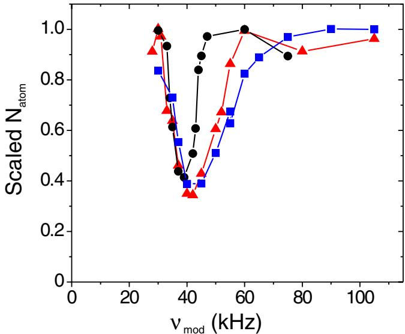
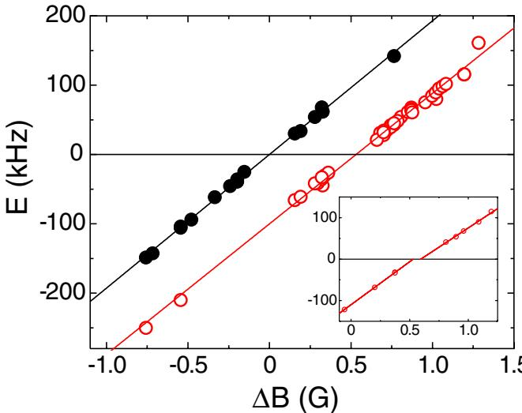
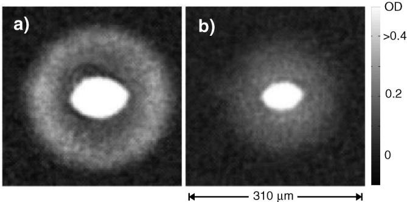
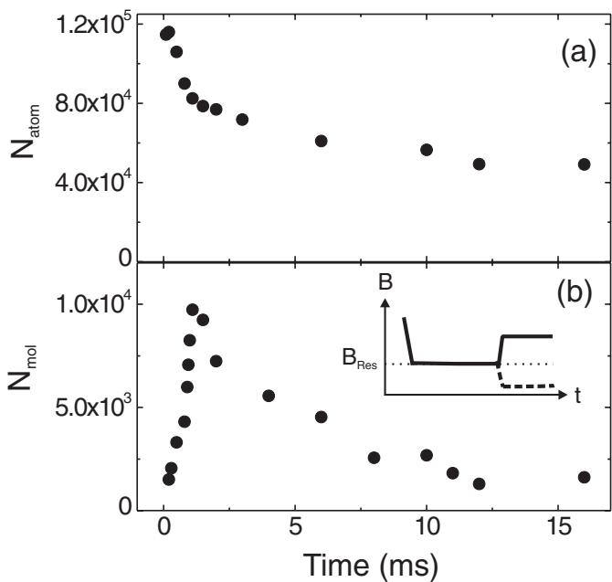
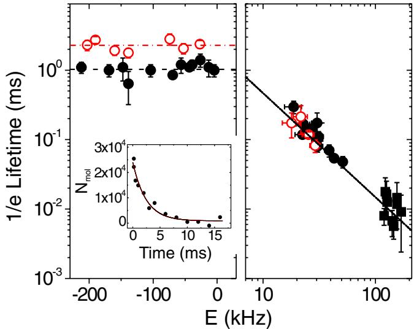

# $\pmb { p }$ -Wave Feshbach Molecules

J. P. Gaebler,\* J. T. Stewart, J. L. Bohn, and D. S. Jin JILA, Quantum Physics Division, National Institute of Standards and Technology and Department of Physics, University of Colorado, Boulder, Colorado 80309-0440, USA (Received 2 March 2007; published 16 May 2007)

We have produced and detected molecules using a $p$ -wave Feshbach resonance between $^ { 4 0 } \mathrm { K }$ atoms. We have measured the binding energy and lifetime for these molecules and we find that the binding energy scales approximately linearly with the magnetic field near the resonance. The lifetime of bound $p$ -wave molecules is measured to be $1 . 0 \pm 0 . 1$ ms and $2 . 3 \pm 0 . 2$ ms for the $m _ { l } = \pm 1$ and $m _ { l } = 0$ angular momentum projections, respectively. At magnetic fields above the resonance, we detect quasibound molecules whose lifetime is set by the tunneling rate through the centrifugal barrier.

DOI: 10.1103/PhysRevLett.98.200403

PACS numbers: 03.75.Ss, 05.30.Fk

Much recent work with atomic Fermi gases has taken advantage of the ability to create strong atom-atom interactions through the use of magnetic-field Feshbach resonances. A Feshbach resonance occurs when the energy difference between a diatomic molecule state and two scattering atoms can be tuned to zero. This energy difference can be tuned with a magnetic field if there is a difference between the magnetic moment of the molecule and that of two free atoms. Experiments have taken advantage of these tunable interactions to study atom pair condensates in the BCS superfluid to Bose-Einstein condensate (BEC) crossover regime [1– 4]. While this work involved pairing with $s \cdot$ -wave interactions, there are several reasons that the study of possible atom condensates with non- $s$ -wave pairing is compelling. For a $p$ -wave paired state, the richness of the superfluid order parameter leads to a complex phase diagram with a variety of phase transitions as a function of temperature and interaction strength [5–8]. Some of these phase transitions are of topological nature [9], and have been predicted to be accessible via detuning between the BCS and BEC limits with a $p$ -wave Feshbach resonance. Furthermore, because $p$ -wave resonances are intrinsically narrow at low energies, due to the centrifugal barrier, a quantitatively accurate theoretical treatment is possible [5,10].

$p$ -wave resonances have been observed in Fermi gases of $^ { 4 0 } \mathrm { K }$ atoms [11,12] and $^ 6 \mathrm { L i }$ atoms [13,14] via measurements of elastic scattering and inelastic loss rates. There is also suggestive evidence for molecule creation in $^ 6 \mathrm { L i }$ using magnetic-field sweeps through the resonance [13]. However, it is still not known whether long-lived Feshbach molecules with nonzero angular momentum can be created from a gas of fermionic atoms.

In this Letter, we present evidence for the production and direct detection of $p$ -wave molecules created with a $p$ -wave Feshbach resonance. We measure the lifetimes and binding energies of these molecules and perform theoretical calculations to interpret our results. We are able to extend our measurements to the $p$ -wave quasibound state.

Our experiments were carried out using a quantum degenerate $^ { 4 0 } \mathrm { K }$ gas near a $p$ -wave resonance between atoms in the $| f , m _ { f } \rangle = | 9 / 2 , - 7 / 2 \rangle$ spin state, where $f$ is the total atomic spin and $m _ { f }$ is the magnetic quantum number. We cool a mixture of ${ \dot { | 9 / 2 } } , - 7 / 2 \rangle$ and $| 9 / 2 , - 9 / 2 \rangle$ atoms to quantum degeneracy in a crossed-beam optical dipole trap using procedures outlined in previous work [15]. The trap consists of a horizontal laser beam along $\hat { z }$ with a $1 / \bar { e ^ { 2 } }$ radius of $3 2 \ \mu \mathrm { { m } }$ and a vertical beam along $\hat { y }$ with a $1 / e ^ { 2 }$ radius of $2 0 0 \ \mu \mathrm { m }$ . A magnetic field points along the $\hat { z }$ direction and is held at $B = 2 0 3 . 5 \mathrm { ~ G ~ }$ during the final stage of evaporation. The final conditions consist of $1 0 ^ { 5 }$ atoms per spin state at a temperature of $T \approx 0 . 2 T _ { F }$ , where $T _ { F } =$ $E _ { F } / k _ { b }$ is the Fermi temperature and $k _ { b }$ is Boltzmann’s constant. The final trap frequencies are typically $\omega _ { r } / 2 \pi =$ $1 8 0 ~ \mathrm { H z }$ and $\omega _ { z } / 2 \pi = 1 8 \ \mathrm { H z }$ , yielding $E _ { F } / h \approx 7 ~ \mathrm { k H z }$ . To probe the atom cloud, we turn off the trapping potential, wait for a variable expansion time of 1.9 to $1 0 \mathrm { m s }$ , and then send a $4 0 ~ \mu \mathrm { s }$ pulse of resonant laser light through the cloud along z^ onto a CCD camera. We expect that this resonant absorption imaging should only be sensitive to atoms, and not to $p$ -wave molecules.

To measure the binding energies of the $p$ -wave molecules, we resonantly associate the atoms into molecules using a sinusoidally modulated magnetic field. This method has been previously used to both dissociate and associate $s$ -wave Feshbach molecules [16,17]. We ramp the magnetic field to a value near the Feshbach resonance and then apply a small sinusoidal oscillation at a frequency $\nu _ { \mathrm { m o d } }$ for a duration of $3 6 \mathrm { m s }$ . The amplitude of the modulation is a Haversine envelope to reduce the power in frequencies other than $\nu _ { \mathrm { m o d } }$ . As we vary $\nu _ { \mathrm { m o d } }$ , we observe a resonant decrease in the number of atoms, $N _ { \mathrm { a t o m } }$ , in the $| 9 / 2 , - 7 / 2 \rangle$ state. Sample data sets are shown in Fig. 1. We interpret the loss of atoms as resonant association to the molecular state.

The line shapes we observe for association to bound states are asymmetric and have widths that increase linearly with cloud energy $E _ { G }$ , which we obtain from the width of a Gaussian fit to an expanded cloud. These line shape features are characteristic of a narrow resonance where the energy width of the atom cloud dominates over any intrinsic width of the resonance. The asymmetry of the line shape reflects the distribution of collision energies in the Fermi gas. For our measurements we used a range of modulation amplitudes of 100 to $5 0 0 \ \mathrm { m G }$ and did not observe any significant amplitude dependent broadening or shifting of the line shapes. However, for our largest modulation amplitudes we observe harmonics of the principal feature.

  
FIG. 1 (color online). Line shapes for association to a bound $p$ -wave molecule using a sinusoidally modulated magnetic field. For this data, $B = 1 9 8 . 1 2 \mathrm { ~ G ~ }$ . We find that the line shape is asymmetric and has a width that depends on the cloud energy $E _ { G }$ , as defined in the text. The data are for values of $E _ { G }$ of $2 . 0 \mathrm { k H z }$ (circles), $4 . 5 \ \mathrm { k H z }$ (triangles), and $6 . 0 \mathrm { k H z }$ (squares). To highlight the asymmetry and dependence on $E _ { G }$ , the total number of atoms $N _ { \mathrm { a t o m } }$ for each line shape was scaled to one.

From the magnetoassociation line shape we can extract the pair energy $E$ relative to the energy of free atoms. Because the line shape shifts as $E _ { G }$ is increased, we extract the resonance position by measuring the frequency for maximum loss at different values of $E _ { G }$ and extrapolating to $E _ { G } = 0$ . This gives a correction whose magnitude is approximately $3 \mathrm { k H z }$ . In Fig. 2 we plot the pair energy as a function of magnetic-field detuning.

As can be seen in Fig. 2, there is a splitting of $0 . 5 1 \pm$ $0 . 0 3 \mathrm { ~ G ~ }$ in the $p$ -wave resonances for $m _ { l } = 0$ and $m _ { l } = \pm 1$ , where $m _ { l }$ is the pair orbital angular momentum projection onto the magnetic-field axis. This splitting is caused by the magnetic dipole interaction and was first observed in Ref. [11] and explained in Ref. [18]. For both resonances, we observe a linear dependence of the pair energy $E$ on magnetic-field detuning.

With resonant magnetoassociation we find that we can associate atoms into quasibound states above the resonance, as well as into bound molecular states below the resonance. These quasibound states are paired states with positive energy and lifetimes set by the tunneling time through the $p$ -wave centrifugal barrier. The height of the barrier for $^ { 4 0 } \mathrm { K }$ is $h \times 5 . 8 ~ \mathrm { M H z }$ , where $h$ is Planck’s constant. This tunneling time causes the widths of line shapes for association to quasibound states to be as much as 3 times greater than for bound states, for data taken with similar initial cloud energies.

  
FIG. 2 (color online). Energy of the molecule as a function of magnetic field for both the $m _ { l } = 0$ (open circles) and $m _ { l } = \pm 1$ (solid circles) resonances. $E < 0$ corresponds to a bound molecule; $E > 0$ corresponds to a quasibound state. $\Delta B$ is the detuning from the $m _ { l } = \pm 1$ resonance position, which we measure to be $B = 1 9 8 . 3 \pm 0 . 0 2 \ : \mathrm { G } .$ Linear fits give a slope of $1 8 8 \pm$ $2 \mathrm { k H z } / \mathrm { G }$ for the $m _ { l } = 0$ resonance and $1 9 3 \pm 2 ~ \mathrm { k H z / G }$ for $m _ { l } = \pm 1$ . The inset shows data for the $m _ { l } = 0$ resonance that suggest some nonlinearity near the resonance. These data were taken all in one day to reduce the uncertainty in the magnetic field.

We have taken advantage of the tunneling of quasibound pairs to observe the molecules. For these experiments we use a spin-polarized gas of atoms in the $| 9 / 2 , - 7 / 2 \rangle$ state to eliminate nonresonant collisions. A pure spin-polarized gas is obtained from a $9 5 / 5$ mixture of $| 9 / 2 , - 7 / 2 \rangle$ and $| 9 / 2 , - 9 / 2 \rangle$ atoms by removing atoms in the spin state $| 9 / 2 , - 9 / 2 \rangle$ with a slow sweep through an $s$ -wave resonance at a magnetic field $B = 2 0 2 . 1 \mathrm { ~ G ~ }$ . Near this resonance, the large inelastic loss rates for high density clouds ensure that nearly all of the atoms in the $| 9 / 2 , - 9 / 2 \rangle$ spin state are lost [19]. The magnetic field is then set to $B =$ $1 9 9 . 7 \mathrm { ~ G ~ }$ , and the optical trap depth is lowered to reach $1 0 ^ { 5 }$ atoms. As the trap depth is lowered to its final value, the spin-polarized Fermi gas is not able to rethermalize because $s$ -wave collisions are forbidden by quantum statistics and higher-order partial wave collisions are frozen out due to the Wigner threshold law. A Gaussian fit to an expanded cloud yields energies of approximately $k _ { b } \times 1 3 0 ~ \mathrm { n K }$ , $k _ { b } \times$ $7 0 ~ \mathrm { n K }$ , and $k _ { b } \times 2 3 0 ~ \mathrm { n K }$ in the $\hat { x } , \ \hat { y }$ , and $\hat { z }$ directions, respectively.

To detect molecules in the gas, we quickly increase the magnetic field, in $1 0 ~ \mu \mathrm { s }$ , to a value above the resonance where quasibound molecules have a large positive energy. The paired atoms then quickly tunnel out of the centrifugal barrier and this energy is converted to kinetic energy of atoms flying apart. We immediately turn off the optical trap, expand for a variable time of 1.9 to $5 \mathrm { m s }$ , and take an absorption image. The result is a large energetic cloud of atoms surrounding the cold gas, as seen in Fig. 3. We note that the $1 0 ~ \mu \mathrm { s }$ magnetic-field ramp is much shorter than any trap period or collision time scale. This is similar to the detection scheme used in Ref. [20]. The angular dependence in the distribution of energetic atoms is consistent with $p$ -wave pairing (see Fig. 3). We have verified that the size of the energetic cloud depends on the magnetic-field ramp, with faster ramps to higher fields yielding larger clouds. To place a lower limit on the molecule number $N _ { \mathrm { m o l } }$ , we can sum the atom signal occurring outside of a certain radius surrounding the cold inner cloud. $N _ { \mathrm { m o l } }$ is $1 / 2$ the number of atoms found outside this radius.

We have measured the lifetimes of $p$ -wave molecules in a spin-polarized gas as a function of magnetic-field detuning from the resonance. We first create molecules by quickly ramping the magnetic field to a value near the resonance and then holding at that field for 1 to $2 ~ \mathrm { m s }$ . The span of magnetic-field values for which we are able to observe molecule creation is approximately $9 0 ~ \mathrm { m G }$ . With this technique, we can transfer nearly $20 \%$ of the initial atom population to molecules, as shown in Fig. 4. For a lifetime measurement, after we create molecules, we ramp the magnetic field to a test value and hold there for a variable amount of time before detecting the molecules. We measure $N _ { \mathrm { m o l } }$ as a function of the hold time at the test magnetic field. A sample lifetime curve is shown in the inset of Fig. 5. We apply this technique to directly measure the lifetime of both the bound and quasibound states. The results of these lifetime measurements (circles) are shown in Fig. 5. Also shown in Fig. 5 are lifetimes extracted from the widths of magnetoassociation line shapes on the quasibound side (squares) [21]. On the quasibound side, we find that the pair lifetime follows the expected $\tau \propto E ^ { - 3 / 2 }$ behavior for tunneling out of a $p$ -wave centrifugal barrier. The lifetimes on the quasibound side of the resonance are well reproduced by a standard multichannel scattering calculation (see Fig. 5), provided that partial waves with $l = 3$ are included as well as those with $l = 1$ . The lifetimes so obtained are about 1.6 times what would be predicted by a single-channel calculation using the triplet potential energy surface. This is because, in the multichannel case, the atoms spend part of their time in higher-lying channels and thus have fewer opportunities to tunnel.

  
FIG. 3. (a) Dissociated $m _ { l } = \pm 1$ molecules in the $x y$ plane. (b) Dissociated $m _ { l } = 0$ molecules in the $x y$ plane. The bright spot in the center corresponds to cold atoms that did not form molecules. The gray scale mapping for the cloud’s optical density (OD) is shown on the right. In each image the dissociation is done with a $1 0 ~ \mu \mathrm { s }$ linear ramp to a $B$ -field value $8 5 0 ~ \mathrm { m G }$ above the respective resonance. The expansion time before imaging is $2 . 5 ~ \mathrm { m s }$ . Each image represents the average of 5–10 shots. To reduce high frequency noise, each pixel is taken to be an average of itself and its four nearest neighbors. The total number of atoms in the $m _ { l } = \pm 1$ images is $50 \%$ higher than for the $m _ { l } = 0$ images. The images are consistent with the expected angular distributions of $\sin ^ { 2 } ( \theta )$ and $\cos ^ { 2 } ( \theta )$ for the $m _ { l } = \pm 1$ and $m _ { l } = 0$ states, respectively, where $\theta$ is the angle from the $\hat { z }$ axis.

  
FIG. 4. (a) Measured atom number as a function of time that the magnetic field is held at the $m _ { l } = \pm 1$ resonance. (b) Measured molecule number for the same hold time on resonance. The inset shows the timing sequence for this experiment. The magnetic field is ramped to the $m _ { l } = \pm 1$ resonance $B _ { \mathrm { R e s } }$ in less than $1 0 0 ~ \mu \mathrm { s }$ and then held at that field for a variable amount of time. At the end of this hold time we measure the number of molecules in the gas using the dissociation technique described in the text (solid line). The number of atoms not in molecules is measured by ramping the field below the resonance where the molecules are deeply bound and then expanding and imaging the atoms at this field (dashed line).

  
FIG. 5 (color online). The lifetimes of $p$ -wave molecules as a function of binding energy. Circles indicate directly measured lifetimes, while squares indicate lifetimes inferred from magnetoassociation line shape widths. Data for the $m _ { l } = 0$ resonance are shown in open symbols, while $m _ { l } = \pm 1$ are closed symbols. The two dotted lines on the left indicate the averages of the measured bound state lifetimes. The solid line on the right is the theory curve for the quasibound lifetimes, as discussed in the text. The inset shows a sample exponential lifetime curve of the $m _ { l } = 0$ bound state taken at $^ { 1 \mathrm { ~ G ~ } }$ below the resonance.

On the bound molecule side, we observe that for magnetic-field detunings as large as $^ \textrm { \scriptsize 1 G }$ from the resonance, the lifetimes are independent of magnetic field and therefore binding energy. The bound $m _ { l } = 0$ molecule lifetime is measured to be $2 . 3 \pm 0 . 2 ~ \mathrm { m s }$ , while the lifetime of molecules created on the $m _ { l } = \pm 1$ resonance is measured to be $1 . 0 \pm 0 . 1 ~ \mathrm { m s }$ . Our multichannel scattering model predicts magnetic-field independent lifetimes set by dipolar relaxation rates. The predicted lifetimes are $8 . 7 \mathrm { \ m s }$ for $m _ { l } = 0$ state, $6 . 8 \mathrm { \ m s }$ for $m _ { l } = 1$ state, and $1 . 5 ~ \mathrm { m s }$ for $m _ { l } = - 1$ state. The shorter measured lifetimes may be explained by molecular collisions; however, we have not yet been able to obtain experimental evidence for a density dependence. The reason for this discrepancy thus remains a challenge for future investigation.

This work has focused on the study of $p$ -wave Feshbach pairs away from the resonance where they are weakly coupled to free atoms. In this regime, we have measured the pair lifetimes and binding energies and, with the exception of the bound molecule lifetimes, find good agreement with two-body theory. We believe that the techniques and results presented here constitute a starting point for attempts to study the many-body properties of these gases near the resonance. Indeed, our data showing pair creation on the resonance represent a first step in studying the behavior of a quantum degenerate Fermi gas in the presence of resonant $p$ -wave interactions.

Unfortunately, in a $^ { 4 0 } \mathrm { K }$ experiment, the short lifetimes measured for the $p$ -wave molecules make it unlikely that one could make $p$ -wave molecular condensates. However, it may be possible to explore many-body physics on the quasibound side of the resonance where $p$ -wave interactions are strongly enhanced and inelastic decay rates can be much slower than the tunneling rate. Furthermore, our studies suggest that longer lifetimes may be possible in other systems if a $p$ -wave resonance occurs at low magnetic field where dipolar relaxation rates could be suppressed or in the lowest Zeeman state of the atoms where dipolar relaxation would be energetically forbidden.

We acknowledge funding from the NSF and NASA. We thank both the JILA BEC group and Leo Radzihovsky for stimulating discussions.

\*Email address: gaeblerj@jila.colorado.edu Electronic address: http://jilawww.colorado.edu/\~jin/   
[1] C. A. Regal, C. Ticknor, J. L. Bohn, and D. S. Jin, Nature (London) 424, 47 (2003).   
[2] S. Jochim et al., Science 302, 2101 (2003).   
[3] C. A. Regal, M. Greiner, and D. S. Jin, Phys. Rev. Lett. 92, 040403 (2004).   
[4] M. W. Zwierlein et al., Phys. Rev. Lett. 92, 120403 (2004).   
[5] V. Gurarie, L. Radzihovsky, and A. V. Andreev, Phys. Rev. Lett. 94, 230403 (2005); V. Gurarie and L. Radzihovsky, Ann. Phys. (N.Y.) 322, 2 (2007).   
[6] C.-H. Cheng and S.-K. Yip, Phys. Rev. Lett. 95, 070404 (2005).   
[7] Y. Ohashi, Phys. Rev. Lett. 94, 050403 (2005).   
[8] S. S. Botelho and C. A. R. S. de Melo, J. Low Temp. Phys. 140, 409 (2005).   
[9] N. Read and D. Green, Phys. Rev. B 61, 10 267 (2000).   
[10] F. Chevy et al., Phys. Rev. A 71, 062710 (2005).   
[11] C. A. Regal, C. Ticknor, J. L. Bohn, and D. S. Jin, Phys. Rev. Lett. 90, 053201 (2003).   
[12] K. Gu¨ nter, T. Sto¨ferle, H. Moritz, M. Ko¨hl, and T. Esslinger, Phys. Rev. Lett. 95, 230401 (2005).   
[13] J. Zhang et al., Phys. Rev. A 70, 030702 (2004).   
[14] C. H. Schunck et al., Phys. Rev. A 71, 045601 (2005).   
[15] C. A. Regal, M. Greiner, S. Giorgini, M. Holland, and D. S. Jin, Phys. Rev. Lett. 95, 250404 (2005).   
[16] M. Greiner, C. A. Regal, and D. S. Jin, Phys. Rev. Lett. 94, 070403 (2005).   
[17] S. T. Thompson, E. Hodby, and C. E. Wieman, Phys. Rev. Lett. 95, 190404 (2005).   
[18] C. Ticknor, C. A. Regal, D. S. Jin, and J. L. Bohn, Phys. Rev. A 69, 042712 (2004).   
[19] C. A. Regal, M. Greiner, and D. S. Jin, Phys. Rev. Lett. 92, 083201 (2004).   
[20] S. Du¨rr, T. Volz, and G. Rempe, Phys. Rev. A 70, 031601(R) (2004).   
[21] In order to convert our width measurements to lifetimes we have subtracted out the contribution to the measured width due to the finite energy distribution of the atoms. The size of this correction is approximately $15 \%$ .